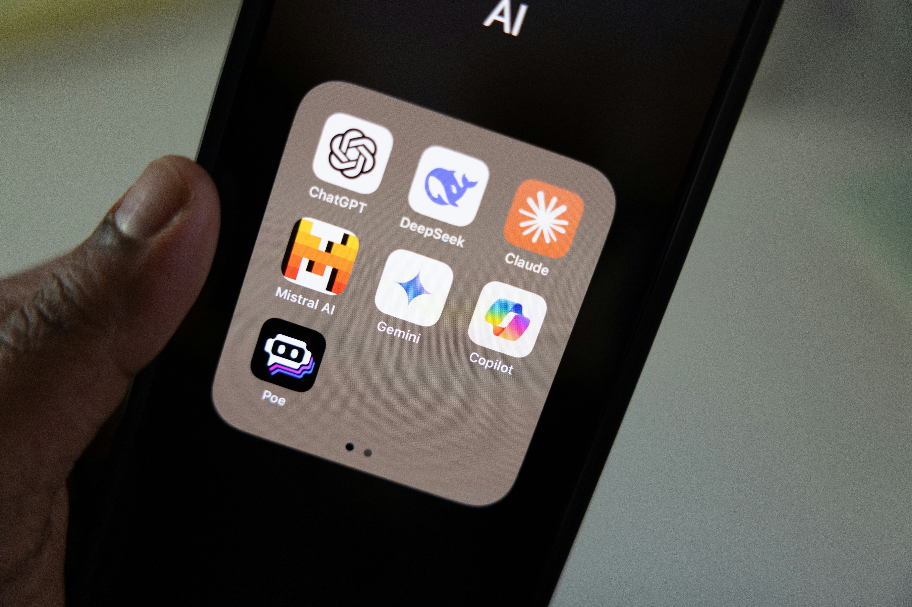

# Claude Code vs Hermes Agent

> 작성일: 2026-09-11
> 비교 기준: Claude Code 2.1.268 / Hermes Agent (Nous Research)

## 이 글을 쓴 이유

요즘 회사에서 AI 관련 교육을 듣고 있는데 내용이 정말 좋다. 그냥 흘려보내기가
아까워서, 시간 될 때 기억나는 부분이라도 조금씩 정리해 두려고 한다. 이 글도
그 기록 중 하나다.

AI가 위험하다느니 어쩌니 해도 이제는 안 쓸 수 없는 시대가 됐다. 특히
개발자에겐 더 그렇다. 쓸지 말지를 고민할 단계는 지났고, 이제는 어떤 도구를
어디에 쓸지를 골라야 하는 단계에 가깝다.

개발용으로는 보통 Claude나 Codex를 쓴다. 반면 개인용으로는 Hermes나 OpenClaw를
많이 쓰는 것 같다. 나는 아직 개인용 에이전트는 써본 적이 없는데, 이번에
Hermes를 한번 써보려고 한다.

그 전에, 매일 쓰는 Claude Code와 Hermes가 실제로 뭐가 어떻게 다른지 정리해
두고 싶었다. 둘 다 'AI 에이전트'로 묶이지만 만들어진 목적이 꽤 달라 보였기
때문이다. 아래가 그 비교다.

---

## 한 줄 요약

둘은 경쟁 관계가 아니다. Hermes는 코딩을 Codex/OpenCode CLI에 **위임**하는 구조라,
실제 구도는 *Hermes = 오케스트레이터 / Claude Code = 실행기*에 가깝다.

---

## 기본

| | Claude Code (2.1.268) | Hermes Agent |
|---|---|---|
| 제작 | Anthropic | Nous Research |
| 라이선스 | 비공개 (SDK·플러그인은 개방) | MIT 오픈소스 |
| 비용 | Claude 구독(Pro/Max) 또는 API 종량제 | 소프트웨어 무료, 모델 비용은 선택한 제공자에 따라 별도 |
| 정체성 | 코딩 에이전트 | 범용 자율 에이전트 ("IDE에 묶인 코파일럿이 아님") |

## 모델

| | Claude Code | Hermes Agent |
|---|---|---|
| 사용 모델 | Claude 전용 (Opus/Sonnet/Haiku) | 아무거나 — Nous Portal, OpenRouter, OpenAI, 자체 엔드포인트 |
| 경유 | Bedrock / Vertex / Foundry | 제공자 무관 |
| 전환 | `/model` | `hermes model` |

## 인터페이스

| | Claude Code | Hermes Agent |
|---|---|---|
| 터미널 | O | O |
| IDE | O (VS Code, JetBrains) | X |
| 데스크톱 앱 | O (Mac/Windows) | X |
| 웹 | O (claude.ai/code) | X |
| 메신저 | X | O (Telegram, Discord, Slack, WhatsApp, Signal 등 20+) |

## 코딩

| | Claude Code | Hermes Agent |
|---|---|---|
| 코드 편집 | 직접 (핵심 기능) | **Codex CLI / OpenCode CLI에 위임** (번들 스킬) |
| 계획 단계 | plan 모드 | — |
| 코드 리뷰 | `/code-review`, `/security-review` | 위임된 CLI에 의존 |
| git/PR | 커밋·PR·워크플로 내장 | 일반 셸 도구로 |
| 되감기 | 파일 체크포인트 + `/rewind` | 미확인 |
| 워크트리 | O (격리된 작업 공간) | 미확인 |

## 확장

| | Claude Code | Hermes Agent |
|---|---|---|
| MCP | O | O |
| 스킬 | 사람이 작성 | **에이전트가 사용 중 자동 생성·개선** |
| 스킬 표준 | 자체 + 플러그인 | agentskills.io 호환 |
| 플러그인/마켓 | O (마켓플레이스) | — |
| 훅 | O (30+ 라이프사이클 이벤트) | 미확인 |
| 내장 도구 | 파일·셸·검색·웹·브라우저 | 60+ (웹검색, 이미지생성, TTS, 브라우저) |

## 메모리 / 학습

| | Claude Code | Hermes Agent |
|---|---|---|
| 프로젝트 지침 | CLAUDE.md | 영속 저장소 |
| 세션 간 기억 | 프로젝트별 자동 메모리 | 전문 검색 + LLM 요약 |
| 자기 개선 | X (사람이 스킬을 씀) | O (도구 호출 15회마다 되돌아보고 스킬 문서 작성) |

## 자동화

| | Claude Code | Hermes Agent |
|---|---|---|
| 예약 실행 | 클라우드 루틴(cron), `/loop` | 내장 cron 스케줄러 |
| 서브에이전트 | O (병렬, 워크플로 오케스트레이션) | O (병렬) |
| 백그라운드 | O (백그라운드 세션, Remote Control) | 메신저를 통한 상시 대기 |
| 원격 실행 | 클라우드 세션, SSH | 로컬/Docker/SSH/Modal/Daytona/서버리스 |

## 보안 (주의)

| | Claude Code | Hermes Agent |
|---|---|---|
| 권한 체계 | O (allow/ask/deny 규칙, 5가지 모드) | **미확인** |
| OS 샌드박스 | O (파일시스템·네트워크 격리) | **미확인** |
| 기업 정책 | O (managed settings, MDM) | **미확인** |

Hermes의 권한·샌드박스 모델은 확인하지 못했다. 자율성과 메신저 상시 접근을
강조하는 설계라, 도입 전에 이 부분을 직접 확인할 것.

---

## 선택 기준

- **코드를 직접 짜고 고치는 일** → Claude Code
- **모델을 자유롭게 바꾸거나, 코드 자체를 포크해서 고치고 싶을 때** → Hermes
- **슬랙·텔레그램에서 말 걸어 시키고 싶을 때** → Hermes
- **권한 통제가 중요한 회사 환경** → Claude Code

---

## 출처

- [Hermes Agent Documentation](https://hermes-agent.nousresearch.com/docs/)
- [NousResearch/hermes-agent (GitHub)](https://github.com/NousResearch/hermes-agent)
- [Hermes 번들 스킬: Codex CLI에 코딩 위임](https://hermes-agent.nousresearch.com/docs/user-guide/skills/bundled/autonomous-ai-agents/autonomous-ai-agents-codex)
